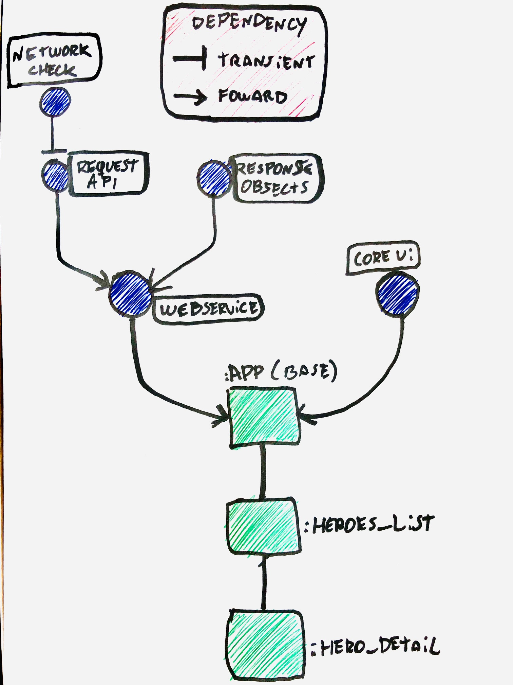

# Marvel Hero List
Android app that uses Marvel API, MVP and modular architecture.

### [APK](https://github.com/nicolasSchirmer/MarvelHeroListV2/blob/master/app-prod-debug.apk)

### Architecture graph

Please check the `.gradle` files to better undertand this graph.

#### [NetworkChecker](https://github.com/nicolasSchirmer/MarvelHeroListV2/tree/master/MarvelList/network-check)
It's a library, 100% context free, that checks reliably if the device really has an internet connection.

#### [Request API](https://github.com/nicolasSchirmer/MarvelHeroListV2/tree/master/MarvelList/request-api)
It's a network layer that executes a Retrofit Callback. The Generics magic happens here. Please take a look in how simple the API call can be with this lib.

#### [Webservice](https://github.com/nicolasSchirmer/MarvelHeroListV2/tree/master/MarvelList/webservice)
It's also a library that contains a network layer. It uses the Request API library to make dead simple API calls.

#### [Response Objects](https://github.com/nicolasSchirmer/MarvelHeroListV2/tree/master/MarvelList/response-objects)
It's a library that contains all the API objects used in this project.

#### [Core UI](https://github.com/nicolasSchirmer/MarvelHeroListV2/tree/master/MarvelList/core-ui)
Core UI is a library that contains all the assets, colours, common styles, etc... So all modules can benefit from it.

#### [App (base)](https://github.com/nicolasSchirmer/MarvelHeroListV2/tree/master/MarvelList/app)
It's a module that act like a dependency bond to all other modules.

#### [Heroes List](https://github.com/nicolasSchirmer/MarvelHeroListV2/tree/master/MarvelList/heroes_list)
Heroes List is a dynamic feature module that shows all the characters on a endless scroll ViewPager.

#### [Hero detail](https://github.com/nicolasSchirmer/MarvelHeroListV2/tree/master/MarvelList/hero_detail)
Hero Detail is a dynamic feature module that shows a character detail and all his comics on an endless RecyclerView.

